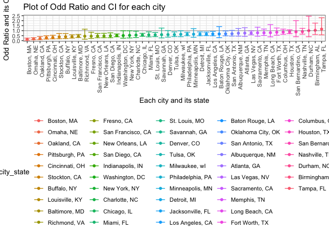

hw6
================
Sijia Yue

Problem 1
---------

``` r
# Read file into the project
file = read_csv("file/homicide-data.csv") %>% 
  janitor::clean_names() 
```

    ## Parsed with column specification:
    ## cols(
    ##   uid = col_character(),
    ##   reported_date = col_integer(),
    ##   victim_last = col_character(),
    ##   victim_first = col_character(),
    ##   victim_race = col_character(),
    ##   victim_age = col_character(),
    ##   victim_sex = col_character(),
    ##   city = col_character(),
    ##   state = col_character(),
    ##   lat = col_double(),
    ##   lon = col_double(),
    ##   disposition = col_character()
    ## )

``` r
homicide_data = 
  file %>% 
  # Add new variable city_state
  mutate(city_state = str_c(city, ", " , state)) %>% 
  mutate(resolved = as.numeric(disposition == "Closed by arrest")) %>% 
  filter(!city_state %in% c("Dallas, TX", "Phoenix, AZ" , "Kansas City, MO" , "Tulsa, AL")) %>% 
  mutate(victim_race = ifelse(victim_race == "White", "white", "non-white"), victim_race = fct_relevel(victim_race, "white")) %>% 
  mutate(victim_age = as.numeric(victim_age))
```

    ## Warning in evalq(as.numeric(victim_age), <environment>): NAs introduced by
    ## coercion

Fit in logistics regression model

``` r
# Filter Baltimore from the list
baltimore_df = 
  homicide_data %>% 
  filter(city == "Baltimore")

# Fit into the logistic regression model with age, sex and race
fit_logistic = 
  baltimore_df %>% 
  glm(resolved ~ victim_age + victim_sex + victim_race, data = ., family = binomial())

# Estimate, CI of adjusted odds ratio
broom::tidy(fit_logistic, conf.int = TRUE, exponentiate = TRUE) %>% 
  filter(term == "victim_racenon-white") %>% 
  mutate(OR = estimate) %>%
  select(term, OR, conf.low, conf.high) %>% 
  knitr::kable(digits = 3)
```

| term                  |     OR|  conf.low|  conf.high|
|:----------------------|------:|---------:|----------:|
| victim\_racenon-white |  0.441|     0.312|       0.62|

Mapping into all cities

``` r
glm_or = function(cities){
  fit_logistic =   
  glm(resolved ~ victim_age + victim_sex + victim_race, data = cities, family = binomial())
  
  broom::tidy(fit_logistic, conf.int = TRUE, exponentiate = TRUE) %>% 
  filter(term == "victim_racenon-white") %>% 
  mutate(OR = estimate) %>%
  select(term, OR, conf.low, conf.high) 
}

glm_result = 
  homicide_data %>% 
  group_by(city_state) %>% 
  select(city_state, victim_race:victim_sex, resolved) %>% 
  nest() %>% 
  # Using the map function to do the iteration
  mutate(result = map(data, glm_or)) %>% 
  select(-data) %>% 
  unnest() %>% 
  select(-term)
```

Plot the OR and CI

``` r
glm_result %>%  
  mutate(city_state = as.factor(city_state)) %>% 
  mutate(city_state = fct_reorder(city_state, OR)) %>% 
  ggplot(aes(x = city_state, y = OR, ymin = conf.low, ymax = conf.high, color = city_state)) +
  geom_point() +
  geom_errorbar() +
  labs(
    title = "Plot of Odd Ratio and CI for each city",
    x = "Each city and its state",
    y = "Odd Ratio and its CI"
  ) +
  theme_bw() +
  theme(legend.position = "bottom",
        axis.text.x = element_text(angle = 90, hjust = 1)) 
```



Problem 2
---------

### Data cleaning

``` r
birth_data = read_csv("file/birthweight.csv") %>% 
  janitor::clean_names() %>% 
  mutate(babysex = as.factor(babysex),
         frace = as.factor(frace),
         malform = as.factor(malform),
         mrace = as.factor(mrace))
```

    ## Parsed with column specification:
    ## cols(
    ##   .default = col_integer(),
    ##   gaweeks = col_double(),
    ##   ppbmi = col_double(),
    ##   smoken = col_double()
    ## )

    ## See spec(...) for full column specifications.

### Fit in my model

First, read the file into R project and explore the correlation using `cor()`.

``` r
read_csv("file/birthweight.csv") %>% 
  select(-pnumlbw, -pnumsga) %>% 
  cor() %>% 
  broom::tidy()
```

    ## Parsed with column specification:
    ## cols(
    ##   .default = col_integer(),
    ##   gaweeks = col_double(),
    ##   ppbmi = col_double(),
    ##   smoken = col_double()
    ## )

    ## See spec(...) for full column specifications.

    ## Warning: 'tidy.matrix' is deprecated.
    ## See help("Deprecated")

    ## # A tibble: 18 x 19
    ##    .rownames  babysex    bhead  blength      bwt    delwt  fincome    frace
    ##    <chr>        <dbl>    <dbl>    <dbl>    <dbl>    <dbl>    <dbl>    <dbl>
    ##  1 babysex    1       -0.169   -0.105   -0.0866  -0.0164  -0.0226   0.0309 
    ##  2 bhead     -0.169    1        0.630    0.747    0.214    0.116   -0.0961 
    ##  3 blength   -0.105    0.630    1        0.743    0.229    0.0787  -0.113  
    ##  4 bwt       -0.0866   0.747    0.743    1        0.288    0.155   -0.179  
    ##  5 delwt     -0.0164   0.214    0.229    0.288    1        0.0350  -0.0648 
    ##  6 fincome   -0.0226   0.116    0.0787   0.155    0.0350   1       -0.285  
    ##  7 frace      0.0309  -0.0961  -0.113   -0.179   -0.0648  -0.285    1      
    ##  8 gaweeks    0.0202   0.378    0.359    0.412    0.124    0.107   -0.114  
    ##  9 malform   -0.0180   0.00300 -0.00902  0.00133  0.0121  -0.00689 -0.0269 
    ## 10 menarche  -0.00629 -0.00302 -0.0211  -0.0244  -0.0859  -0.00354  0.0212 
    ## 11 mheight    0.00774  0.117    0.160    0.192    0.411    0.131   -0.201  
    ## 12 momage    -0.0372   0.108    0.0802   0.136    0.0740   0.323   -0.187  
    ## 13 mrace      0.0360  -0.110   -0.132   -0.208   -0.0922  -0.305    0.829  
    ## 14 parity     0.0230  -0.0200  -0.0325  -0.00837 -0.00471 -0.0259   0.00118
    ## 15 ppbmi     -0.00699  0.0866   0.0740   0.0939   0.721   -0.0202   0.0459 
    ## 16 ppwt      -0.00101  0.137    0.149    0.183    0.871    0.0473  -0.0596 
    ## 17 smoken    -0.0278  -0.0539  -0.0656  -0.0756   0.0486   0.0779  -0.173  
    ## 18 wtgain    -0.0315   0.183    0.191    0.247    0.425   -0.0160  -0.0218 
    ## # ... with 11 more variables: gaweeks <dbl>, malform <dbl>,
    ## #   menarche <dbl>, mheight <dbl>, momage <dbl>, mrace <dbl>,
    ## #   parity <dbl>, ppbmi <dbl>, ppwt <dbl>, smoken <dbl>, wtgain <dbl>

Then, I try to fit all the variables to figure out the fit.

``` r
fit_all = 
  lm(bwt ~ ., data = birth_data)

summary(fit_all)
```

    ## 
    ## Call:
    ## lm(formula = bwt ~ ., data = birth_data)
    ## 
    ## Residuals:
    ##      Min       1Q   Median       3Q      Max 
    ## -1097.68  -184.86    -3.33   173.09  2344.15 
    ## 
    ## Coefficients: (3 not defined because of singularities)
    ##               Estimate Std. Error t value Pr(>|t|)    
    ## (Intercept) -6265.3914   660.4011  -9.487  < 2e-16 ***
    ## babysex2       28.7073     8.4652   3.391 0.000702 ***
    ## bhead         130.7781     3.4523  37.881  < 2e-16 ***
    ## blength        74.9536     2.0217  37.075  < 2e-16 ***
    ## delwt           4.1007     0.3948  10.386  < 2e-16 ***
    ## fincome         0.2898     0.1795   1.614 0.106551    
    ## frace2         14.3313    46.1501   0.311 0.756168    
    ## frace3         21.2361    69.2960   0.306 0.759273    
    ## frace4        -46.9962    44.6782  -1.052 0.292912    
    ## frace8          4.2969    74.0741   0.058 0.953745    
    ## gaweeks        11.5494     1.4654   7.882 4.06e-15 ***
    ## malform1        9.7650    70.6259   0.138 0.890039    
    ## menarche       -3.5508     2.8951  -1.226 0.220083    
    ## mheight         9.7874    10.3116   0.949 0.342588    
    ## momage          0.7593     1.2221   0.621 0.534418    
    ## mrace2       -151.4354    46.0453  -3.289 0.001014 ** 
    ## mrace3        -91.3866    71.9190  -1.271 0.203908    
    ## mrace4        -56.4787    45.1369  -1.251 0.210901    
    ## parity         95.5411    40.4793   2.360 0.018307 *  
    ## pnumlbw             NA         NA      NA       NA    
    ## pnumsga             NA         NA      NA       NA    
    ## ppbmi           4.3538    14.8913   0.292 0.770017    
    ## ppwt           -3.4716     2.6121  -1.329 0.183913    
    ## smoken         -4.8544     0.5871  -8.269  < 2e-16 ***
    ## wtgain              NA         NA      NA       NA    
    ## ---
    ## Signif. codes:  0 '***' 0.001 '**' 0.01 '*' 0.05 '.' 0.1 ' ' 1
    ## 
    ## Residual standard error: 272.5 on 4320 degrees of freedom
    ## Multiple R-squared:  0.7183, Adjusted R-squared:  0.717 
    ## F-statistic: 524.6 on 21 and 4320 DF,  p-value: < 2.2e-16

The adjusted r square is 0.717, which means it is a good fit. However, the variables are too many so it would have the chance to be over fitted. So, I will choose the variable according to the p value.

Then, I try to fit in the model with p value extremely equal to zero.

``` r
fit_model1 = lm(bwt ~ babysex + bhead + blength + delwt + gaweeks + smoken 
                , data = birth_data)

summary(fit_model1)
```

    ## 
    ## Call:
    ## lm(formula = bwt ~ babysex + bhead + blength + delwt + gaweeks + 
    ##     smoken, data = birth_data)
    ## 
    ## Residuals:
    ##      Min       1Q   Median       3Q      Max 
    ## -1181.20  -183.63    -9.49   174.43  2506.57 
    ## 
    ## Coefficients:
    ##               Estimate Std. Error t value Pr(>|t|)    
    ## (Intercept) -6285.7402    97.0521 -64.767  < 2e-16 ***
    ## babysex2       30.3364     8.7343   3.473 0.000519 ***
    ## bhead         137.1933     3.5353  38.806  < 2e-16 ***
    ## blength        78.8032     2.0720  38.033  < 2e-16 ***
    ## delwt           2.0766     0.1994  10.416  < 2e-16 ***
    ## gaweeks        14.0748     1.4976   9.398  < 2e-16 ***
    ## smoken         -2.1711     0.5823  -3.729 0.000195 ***
    ## ---
    ## Signif. codes:  0 '***' 0.001 '**' 0.01 '*' 0.05 '.' 0.1 ' ' 1
    ## 
    ## Residual standard error: 282 on 4335 degrees of freedom
    ## Multiple R-squared:  0.6973, Adjusted R-squared:  0.6969 
    ## F-statistic:  1665 on 6 and 4335 DF,  p-value: < 2.2e-16

We could see that the adjusted R square decreases to 0.697. So, I would add some more variable that p value less than 0.01.

``` r
fit_model2 = lm(bwt ~ babysex + bhead + blength + delwt + gaweeks + mrace + smoken 
                , data = birth_data)

summary(fit_model2)
```

    ## 
    ## Call:
    ## lm(formula = bwt ~ babysex + bhead + blength + delwt + gaweeks + 
    ##     mrace + smoken, data = birth_data)
    ## 
    ## Residuals:
    ##      Min       1Q   Median       3Q      Max 
    ## -1120.47  -181.53    -6.01   173.39  2338.34 
    ## 
    ## Coefficients:
    ##               Estimate Std. Error t value Pr(>|t|)    
    ## (Intercept) -5814.2727    98.8293 -58.831  < 2e-16 ***
    ## babysex2       29.2229     8.4968   3.439 0.000589 ***
    ## bhead         131.8628     3.4620  38.089  < 2e-16 ***
    ## blength        75.7996     2.0220  37.488  < 2e-16 ***
    ## delwt           2.2667     0.1962  11.553  < 2e-16 ***
    ## gaweeks        11.8658     1.4619   8.117 6.19e-16 ***
    ## mrace2       -146.8837     9.2486 -15.882  < 2e-16 ***
    ## mrace3        -71.6869    42.5050  -1.687 0.091762 .  
    ## mrace4       -120.0461    18.7754  -6.394 1.79e-10 ***
    ## smoken         -4.7516     0.5885  -8.074 8.76e-16 ***
    ## ---
    ## Signif. codes:  0 '***' 0.001 '**' 0.01 '*' 0.05 '.' 0.1 ' ' 1
    ## 
    ## Residual standard error: 274 on 4332 degrees of freedom
    ## Multiple R-squared:  0.7144, Adjusted R-squared:  0.7138 
    ## F-statistic:  1204 on 9 and 4332 DF,  p-value: < 2.2e-16

The adjusted R square increases to 0.7138, so model 2 is better than model 1.

Then, I will try to add more variable which p value is less than 0.05.

``` r
fit_model3 = lm(bwt ~ babysex + bhead + blength + delwt + gaweeks + mrace + parity + smoken 
                , data = birth_data)

summary(fit_model3)
```

    ## 
    ## Call:
    ## lm(formula = bwt ~ babysex + bhead + blength + delwt + gaweeks + 
    ##     mrace + parity + smoken, data = birth_data)
    ## 
    ## Residuals:
    ##      Min       1Q   Median       3Q      Max 
    ## -1119.67  -181.24    -5.87   173.51  2340.76 
    ## 
    ## Coefficients:
    ##               Estimate Std. Error t value Pr(>|t|)    
    ## (Intercept) -5822.5934    98.8325 -58.914  < 2e-16 ***
    ## babysex2       28.6609     8.4951   3.374 0.000748 ***
    ## bhead         131.6982     3.4607  38.056  < 2e-16 ***
    ## blength        75.8653     2.0210  37.538  < 2e-16 ***
    ## delwt           2.2649     0.1961  11.550  < 2e-16 ***
    ## gaweeks        12.1400     1.4654   8.284  < 2e-16 ***
    ## mrace2       -146.7893     9.2435 -15.880  < 2e-16 ***
    ## mrace3        -71.5880    42.4809  -1.685 0.092026 .  
    ## mrace4       -119.5979    18.7656  -6.373 2.04e-10 ***
    ## parity         98.6113    40.5334   2.433 0.015021 *  
    ## smoken         -4.7472     0.5882  -8.071 8.96e-16 ***
    ## ---
    ## Signif. codes:  0 '***' 0.001 '**' 0.01 '*' 0.05 '.' 0.1 ' ' 1
    ## 
    ## Residual standard error: 273.8 on 4331 degrees of freedom
    ## Multiple R-squared:  0.7148, Adjusted R-squared:  0.7142 
    ## F-statistic:  1086 on 10 and 4331 DF,  p-value: < 2.2e-16
